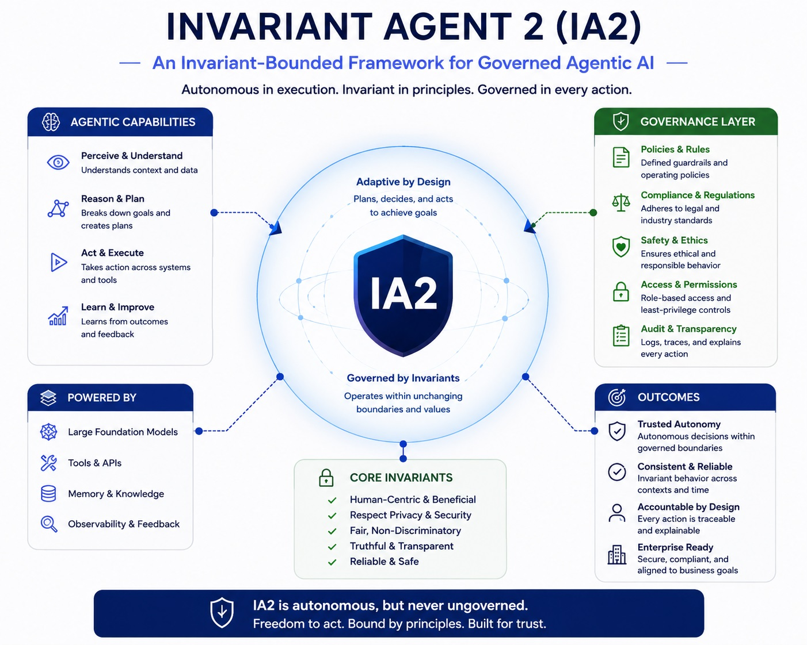

# InvariantAgent2 (IA2)



A reference implementation of the **Invariant-Bounded Agent Alignment Model (IBAAM)**.

InvariantAgent2 explores governed agent runtimes where behavioural constraints remain external to adaptive cognition. Rather than allowing an LLM to directly govern system behaviour, all actions, state transitions, and self-modifications are evaluated under invariant-based runtime control.

---

## Why InvariantAgent2?

Most agent frameworks place the LLM at the centre of decision making.

InvariantAgent2 takes a different approach.

The planner (LLM or otherwise) is treated as an untrusted cognitive component that proposes actions. Runtime governance, invariant enforcement, and state transition control remain external to the planner.

This enables adaptive agents to evolve while maintaining:

- explicit behavioural constraints
- replayable execution
- auditable decision making
- governed self-modification
- bounded behavioural evolution

InvariantAgent2 serves as a reference implementation of the **Invariant-Bounded Agent Alignment Model (IBAAM)**.

---

## Quick Start

```bash
dotnet run --project InvariantAgent.ConsoleApp
```

Example:

```text
agent> calc 10+20
[Lifecycle] Phase: InputReceived
[Input] calc 10+20
[Lifecycle] Phase: Planning
[Planning] Capability=calc
[Lifecycle] Phase: PlanValidation
[Invariant] NoDeleteInvariant: Passed
[Invariant] AllowedCapabilityInvariant: Passed
[Control] Plan invariants passed
[Lifecycle] Phase: Execution
[Execution] 30
[Lifecycle] Phase: ExecutionValidation
[Invariant] SuccessOutcomeInvariant: Passed
[Invariant] NonEmptyOutcomeInvariant: Passed
[Control] Execution invariants passed
[Lifecycle] Phase: SelfModificationValidation
[Invariant] AllowedMemoryKeyInvariant: Passed
[Control] SelfModification invariants passed
[Lifecycle] Phase: Reduction
[Reduction] ProposedVersion=1
[Invariant] BehaviouralDriftBoundInvariant: Passed
[Control] Reduction invariants passed
[Lifecycle] CommittedVersion=1
[Lifecycle] Phase: Completed
Transition Id: 5594c376-2201-4616-b35f-dd126458bf57
Status: Completed
```

---

## Core Idea

LLMs are treated as **cognitive generators**, not governing authorities.

Every proposed action passes through invariant-bounded runtime control before execution or state mutation occurs.

The runtime governs:

- planning
- execution
- state evolution
- self-modification
- transition persistence
- behavioural auditing

---

## Runtime Hierarchy

```text
invariants
    >
runtime governance
    >
planner
    >
capabilities
```

Invariants define admissible behavioural boundaries.

The runtime governs transitions.

Planners propose actions.

Capabilities perform execution.

Reducers assimilate approved state evolution.

---

## Architecture

```text
Core
  Contracts, models, transitions, projections

Runtime
  Governed transition lifecycle orchestration

Control
  Pre/post invariant enforcement

Execution
  Capability execution and mediation

Adaptive
  Planners, memory, self-modification proposals

Observability
  Replay, drift analysis, stability evaluation, transition tracing

Storage
  Transition persistence
```

---

## IBAAM Mapping

| InvariantAgent2 Component | IBAAM Layer |
|--------------------------|-------------|
| Planner | Adaptive Layer |
| Runtime | Execution Layer |
| Invariants | Control Layer |
| Replay & Drift Analysis | Observability Layer |
| Reducers | State Assimilation |
| Transition Store | Persistence |

---

## Governed Transition Lifecycle

Every interaction executes through a governed transition pipeline:

```text
Input
 -> Planning
 -> Pre-Control
 -> Capability Execution
 -> Post-Control
 -> State Assimilation
 -> Transition Persistence
```

Every transition records:

- prior state
- proposed action
- execution outcome
- invariant decisions
- adaptive modifications
- resulting state

Rejected transitions are also persisted and remain available for:

- replay
- auditing
- drift analysis
- governance inspection

---

## Example Governed Transition

The following session demonstrates:

- planning
- invariant evaluation
- capability execution
- state evolution
- rejected actions
- replay and auditing
- governed self-modification
- drift analysis

All state changes occur only after invariant approval.

### Quick Example

```text
agent> calc 10+20
[Lifecycle] Phase: InputReceived
[Input] calc 10+20
[Lifecycle] Phase: Planning
[Planning] Capability=calc
[Lifecycle] Phase: PlanValidation
[Invariant] NoDeleteInvariant: Passed
[Invariant] AllowedCapabilityInvariant: Passed
[Control] Plan invariants passed
[Lifecycle] Phase: Execution
[Execution] 30
[Lifecycle] Phase: ExecutionValidation
[Invariant] SuccessOutcomeInvariant: Passed
[Invariant] NonEmptyOutcomeInvariant: Passed
[Control] Execution invariants passed
[Lifecycle] Phase: SelfModificationValidation
[Invariant] AllowedMemoryKeyInvariant: Passed
[Control] SelfModification invariants passed
[Lifecycle] Phase: Reduction
[Reduction] ProposedVersion=1
[Invariant] BehaviouralDriftBoundInvariant: Passed
[Control] Reduction invariants passed
[Lifecycle] CommittedVersion=1
[Lifecycle] Phase: Completed
Transition Id: 5594c376-2201-4616-b35f-dd126458bf57
Status: Completed

agent> memory-set goal=learn IBAAM
[Lifecycle] Phase: InputReceived
[Input] memory-set goal=learn IBAAM
[Lifecycle] Phase: Planning
[Planning] Capability=memory-set
[Lifecycle] Phase: PlanValidation
[Invariant] NoDeleteInvariant: Passed
[Invariant] AllowedCapabilityInvariant: Passed
[Control] Plan invariants passed
[Lifecycle] Phase: Execution
[SelfModification] memory.set goal
[Execution] Proposed memory update: goal
[Lifecycle] Phase: ExecutionValidation
[Invariant] SuccessOutcomeInvariant: Passed
[Invariant] NonEmptyOutcomeInvariant: Passed
[Control] Execution invariants passed
[Lifecycle] Phase: SelfModificationValidation
[Invariant] AllowedMemoryKeyInvariant: Passed
[Control] SelfModification invariants passed
[Lifecycle] Phase: Reduction
[SelfModification] Set goal
[Reduction] ProposedVersion=2
[Invariant] BehaviouralDriftBoundInvariant: Passed
[Control] Reduction invariants passed
[Lifecycle] CommittedVersion=2
[Lifecycle] Phase: Completed
Transition Id: 90a02255-8610-4b90-99fe-380151a9e5cd
Status: Completed

agent> boo
[Lifecycle] Phase: InputReceived
[Input] boo
[Lifecycle] Phase: Planning
[Planning] Capability=boo
[Lifecycle] Phase: PlanValidation
[Invariant] NoDeleteInvariant: Passed
[Invariant] AllowedCapabilityInvariant: Failed Capability 'boo' is not allowed or unknown.
[Control] Plan invariants failed: AllowedCapabilityInvariant: Capability 'boo' is not allowed or unknown.
[Lifecycle] Phase: Rejected
Transition Id: ced39314-d599-4813-9f9b-b0d8cadf82d4
Status: Rejected
```

---

## State Projection

Planners do not receive unrestricted access to runtime state.

Instead they operate on a bounded projection:

```text
π(Sₜ)
```

containing:

- goals
- memory summaries
- prior outcomes
- active policies
- runtime versioning

This creates a controlled cognitive interface between adaptive reasoning and governed execution.

---

## Self-Modification Governance

InvariantAgent2 supports governed adaptive evolution.

Capabilities may propose:

- memory updates
- goal changes
- policy evolution
- future adaptive modifications

Capabilities cannot directly modify runtime state.

Instead:

1. A modification is proposed.
2. Invariants evaluate admissibility.
3. Approved changes are assimilated by reducers.

Example:

```text
memory-set goal=plan a healthy weekly routine
```

The modification becomes part of runtime state only after successful governance evaluation.

---

## Behavioural Stability Evaluation

InvariantAgent2 includes a behavioural stability evaluation layer that measures how agent behaviour changes over time without replacing invariant-based governance.

The stability evaluator consumes transition history, capability usage, state changes, outcomes, and invariant failures to produce:

- stability vectors
- drift magnitude
- stability regions
- governance recommendations

These measurements indicate behavioural change. Invariants remain responsible for determining whether change is acceptable.

---

## Features

- Governed transition runtime
- Invariant-bounded execution
- Replayable transition history
- Drift and behavioural stability analysis
- Adaptive memory
- Governed self-modification
- Capability mediation
- Pre/post execution control
- Replaceable planners
- Deterministic execution paths
- Event-oriented state evolution
- Runtime observability
- Behavioural stability evaluation

---

## Planner Support

- OpenAI planners
- Google Gemini planners
- Deterministic command planners
- Extensible planner abstraction

---

## Current Capabilities

- `echo`
- `search`
- `calc`
- `explain`
- `replay`
- `replay verbose`
- `drift`
- `memory-set`
- `memory-show`
- `baseline-show`
- `baseline-approve`

Additional capabilities can be added through the capability registry.

---

## Running

```bash
dotnet run --project InvariantAgent.ConsoleApp
```

Entry point:

```text
InvariantAgent.ConsoleApp/Program.cs
```

---

## Research

InvariantAgent2 serves as the reference implementation of the:

### Invariant-Bounded Agent Alignment Model (IBAAM)

Original paper:

[Engineering Stable Behaviour in Self-Modifying LLMs](https://www.researchgate.net/publication/405207593_Engineering_Stable_Behaviour_in_Self-Modifying_LLM_Agents)

---

## Research Directions

Current areas of investigation include:

- governed adaptive evolution
- bounded self-modification
- runtime-enforced alignment
- transition-governed cognition
- behavioural drift measurement
- replayable agent execution
- invariant-based behavioural stability assessment

The project remains intentionally experimental and architecture-focused.