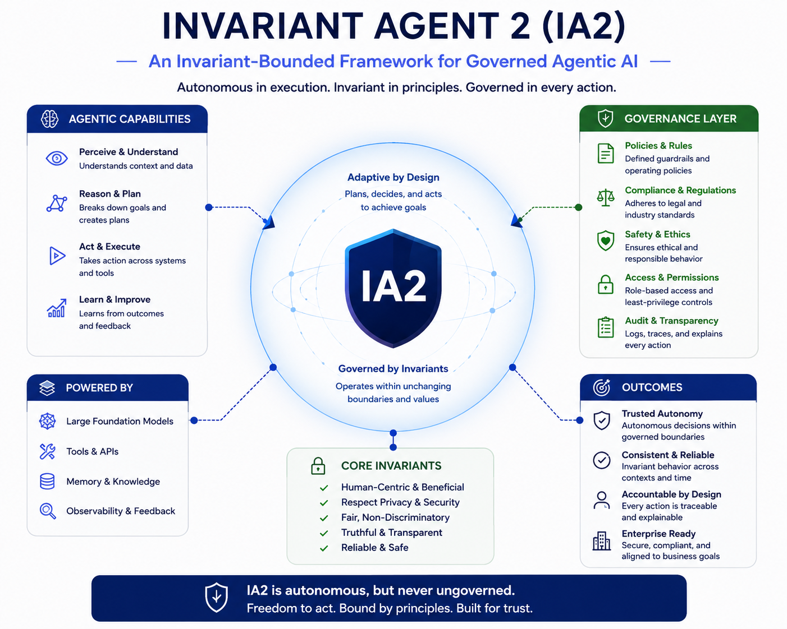

# InvariantAgent 2 (IA2)

A reference implementation of the **Invariant-Bounded Agent Alignment Model (IBAAM)**.

InvariantAgent explores governed agent runtimes where:
- invariants define behavioural boundaries,
- adaptive evolution is runtime-controlled,
- planners are replaceable cognitive components,
- and capabilities operate inside governed execution.

---

# Core Idea

LLMs are treated as **untrusted cognitive generators**.

They do not govern the system.

Instead, all proposed actions pass through invariant-bounded runtime control.

The runtime governs:
- planning,
- execution,
- adaptive state evolution,
- self-modification,
- and transition assimilation.

LLMs therefore become:
- planning components,
- not governing authorities.

---

# Runtime Hierarchy

```text
invariants
    >
runtime governance
    >
planner
    >
capabilities
```

This differs philosophically from many current agent frameworks, where the LLM itself implicitly becomes the governing entity.

In InvariantAgent:
- invariants define admissible boundaries,
- the runtime governs transitions,
- planners propose actions,
- capabilities execute actions,
- reducers assimilate approved evolution.

---

# Architecture

```text
Core
  Contracts, models, transitions, projections

Runtime
  Governed transition lifecycle orchestration

Control
  Pre/post invariant enforcement

Execution
  Capability execution and mediation

Adaptive
  Planners, memory, self-modification proposals

Observability
  Replay, drift analysis, transition tracing

Storage
  Transition persistence
```

---

# Governed Transition Lifecycle

InvariantAgent executes through governed state transitions:

```text
Input
 -> Planning
 -> Pre-Control
 -> Capability Execution
 -> Post-Control
 -> State Assimilation
 -> Transition Persistence
```

Every transition records:
- before state,
- proposed action,
- execution outcome,
- invariant decisions,
- adaptive modifications,
- resulting state evolution.

Rejected transitions are preserved for:
- replay,
- audit,
- drift analysis,
- governance inspection.

---

# State Projection

Planners do not receive unrestricted mutable runtime state.

Instead, they operate on a controlled projection:

```text
π(Sₜ)
```

including:
- goals,
- memory summaries,
- prior outcomes,
- active policies,
- runtime versioning.

This creates a bounded cognitive interface between:
- adaptive reasoning,
- and governed execution.

---

# Self-Modification Governance

InvariantAgent supports governed adaptive evolution.

Capabilities may propose:
- memory changes,
- goal updates,
- policy evolution,
- future adaptive modifications.

However:
- capabilities cannot directly mutate runtime state.

Instead:
- modifications are proposed,
- invariants govern admissibility,
- reducers assimilate approved changes.

Example:

```text
memory-set goal=plan a healthy weekly routine
```

This creates:
- a proposed self-modification,
- evaluated under invariant governance,
- before becoming part of runtime memory.

---

# Features

- Governed transition runtime
- Invariant-bounded execution
- Replayable transition history
- Drift analysis
- Adaptive memory
- Governed self-modification
- Capability mediation
- Pre/post execution control
- Replaceable planners
- Deterministic execution paths
- Event-oriented state evolution
- Runtime observability

---

# Planner Support

- OpenAI planners
- Google Gemini planners
- Deterministic command planners
- Extensible planner abstraction

---

# Current Capabilities

- `echo`
- `search`
- `calc`
- `replay`
- `drift`
- `memory-set`
- `memory-show`

Additional capabilities can be added through the capability registry.

---

# Running

InvariantAgent 3 uses a hosted governed runtime architecture.

```bash
dotnet run --project InvariantAgent.ConsoleApp
```

Entry point:

```text
InvariantAgent.ConsoleApp/Program.cs
```

---

# Example Session

```text
=== InvariantAgent REPL ===
Commands:
  exit  - quit
  clear - clear screen

agent> echo hello
[Input] echo hello
[Planning] Capability=echo
[Invariant] NoDeleteInvariant: Passed
[Invariant] AllowedCapabilityInvariant: Passed
[PreControl] Allowed
[Execution] hello
[Invariant] SuccessOutcomeInvariant: Passed
[Invariant] AllowedMemoryKeyInvariant: Passed
[Invariant] NonEmptyOutcomeInvariant: Passed
[PostControl] Accepted
[Reducer] Version=1
Status: Completed

agent> calc 10+20
[Input] calc 10+20
[Planning] Capability=calc
[Invariant] NoDeleteInvariant: Passed
[Invariant] AllowedCapabilityInvariant: Passed
[PreControl] Allowed
[Execution] 30
[Invariant] SuccessOutcomeInvariant: Passed
[Invariant] AllowedMemoryKeyInvariant: Passed
[Invariant] NonEmptyOutcomeInvariant: Passed
[PostControl] Accepted
[Reducer] Version=2
Status: Completed

agent> memory-show
[Input] memory-show
[Planning] Capability=memory-show
[Invariant] NoDeleteInvariant: Passed
[Invariant] AllowedCapabilityInvariant: Passed
[PreControl] Allowed
[Execution]
==== MEMORY ====
lastOutcome=30
==== END MEMORY ====
[Invariant] SuccessOutcomeInvariant: Passed
[Invariant] AllowedMemoryKeyInvariant: Passed
[Invariant] NonEmptyOutcomeInvariant: Passed
[PostControl] Accepted
[Reducer] Version=3
Status: Completed

agent> boo
[Input] boo
[Planning] Capability=boo
[Invariant] NoDeleteInvariant: Passed
[Invariant] AllowedCapabilityInvariant: Failed Capability 'boo' is not allowed.
[PreControl] Rejected: Invariant 'AllowedCapabilityInvariant' failed: Capability 'boo' is not allowed.
Status: Rejected

agent> replay
[Input] replay
[Planning] Capability=replay
[Invariant] NoDeleteInvariant: Passed
[Invariant] AllowedCapabilityInvariant: Passed
[PreControl] Allowed
[Execution]
==== REPLAY START ====
Transition=b63e6414-15bd-4f23-a8bf-183971a07bf1
State = 0 -> 1
Status=Completed
[Input] echo hello
[Planning] Capability=echo
[Invariant] NoDeleteInvariant: Passed
[Invariant] AllowedCapabilityInvariant: Passed
[PreControl] Allowed
[Execution] hello
[Invariant] SuccessOutcomeInvariant: Passed
[Invariant] AllowedMemoryKeyInvariant: Passed
[Invariant] NonEmptyOutcomeInvariant: Passed
[PostControl] Accepted
[Reducer] Version=1
Memory:
  lastOutcome=hello

Transition=7df0cdcd-5142-47a0-abda-4ac85611ad1d
State = 1 -> 2
Status=Completed
[Input] calc 10+20
[Planning] Capability=calc
[Invariant] NoDeleteInvariant: Passed
[Invariant] AllowedCapabilityInvariant: Passed
[PreControl] Allowed
[Execution] 30
[Invariant] SuccessOutcomeInvariant: Passed
[Invariant] AllowedMemoryKeyInvariant: Passed
[Invariant] NonEmptyOutcomeInvariant: Passed
[PostControl] Accepted
[Reducer] Version=2
Memory:
  lastOutcome=30

Transition=b19b9cf2-b577-4b2e-9ddb-cc247524a030
State = 2 -> 3
Status=Completed
[Input] memory-show
[Planning] Capability=memory-show
[Invariant] NoDeleteInvariant: Passed
[Invariant] AllowedCapabilityInvariant: Passed
[PreControl] Allowed
[Execution]
==== MEMORY ====
lastOutcome=30
==== END MEMORY ====
[Invariant] SuccessOutcomeInvariant: Passed
[Invariant] AllowedMemoryKeyInvariant: Passed
[Invariant] NonEmptyOutcomeInvariant: Passed
[PostControl] Accepted
[Reducer] Version=3
Memory:
  lastOutcome=
==== MEMORY ====
lastOutcome=30
==== END MEMORY ====

Transition=91ab5f68-455c-48ba-8c0d-9cc5a0d2e695
State = 3 -> not applied
Status=Rejected
Reason=Invariant 'AllowedCapabilityInvariant' failed: Capability 'boo' is not allowed.
[Input] boo
[Planning] Capability=boo
[Invariant] NoDeleteInvariant: Passed
[Invariant] AllowedCapabilityInvariant: Failed Capability 'boo' is not allowed.
[PreControl] Rejected: Invariant 'AllowedCapabilityInvariant' failed: Capability 'boo' is not allowed.

==== REPLAY END ====
[Invariant] SuccessOutcomeInvariant: Passed
[Invariant] AllowedMemoryKeyInvariant: Passed
[Invariant] NonEmptyOutcomeInvariant: Passed
[PostControl] Accepted
[Reducer] Version=4
Status: Completed

agent> memory-set goal=learn IBAAM
[Input] memory-set goal=learn IBAAM
[Planning] Capability=memory-set
[Invariant] NoDeleteInvariant: Passed
[Invariant] AllowedCapabilityInvariant: Passed
[PreControl] Allowed
[SelfModification] memory.set goal
[Execution] Proposed memory update: goal
[Invariant] SuccessOutcomeInvariant: Passed
[Invariant] AllowedMemoryKeyInvariant: Passed
[Invariant] NonEmptyOutcomeInvariant: Passed
[PostControl] Accepted
[Memory] Set goal
[Reducer] Version=5
Status: Completed

agent> memory-show
[Input] memory-show
[Planning] Capability=memory-show
[Invariant] NoDeleteInvariant: Passed
[Invariant] AllowedCapabilityInvariant: Passed
[PreControl] Allowed
[Execution]
==== MEMORY ====
lastOutcome=Proposed memory update: goal
goal=learn IBAAM
==== END MEMORY ====
[Invariant] SuccessOutcomeInvariant: Passed
[Invariant] AllowedMemoryKeyInvariant: Passed
[Invariant] NonEmptyOutcomeInvariant: Passed
[PostControl] Accepted
[Reducer] Version=6
Status: Completed

agent> drift
[Input] drift
[Planning] Capability=drift
[Invariant] NoDeleteInvariant: Passed
[Invariant] AllowedCapabilityInvariant: Passed
[PreControl] Allowed
[Execution]
==== DRIFT REPORT ====
Transitions: 7
Rejected: 1

Capability usage:
  echo: 1
  calc: 1
  memory-show: 2
  boo: 1
  replay: 1
  memory-set: 1

Invariant failures:
  AllowedCapabilityInvariant: 1
==== END DRIFT REPORT ====
[Invariant] SuccessOutcomeInvariant: Passed
[Invariant] AllowedMemoryKeyInvariant: Passed
[Invariant] NonEmptyOutcomeInvariant: Passed
[PostControl] Accepted
[Reducer] Version=7
Status: Completed

agent> quit

F:\InvariantAgent.ConsoleApp.exe (process 22392) exited with code 0 (0x0).
Press any key to close this window . . .
```
---

# IBAAM

InvariantAgent is the reference implementation of the:

## Invariant-Bounded Agent Alignment Model (IBAAM)

Original paper:

https://drive.google.com/file/d/1IVljpg-cmN2Q_pIryRBfT77NqDpSERc-/view

---

# Current Research Direction

InvariantAgent is currently exploring:
- governed adaptive evolution,
- bounded self-modification,
- runtime-enforced alignment,
- transition-governed cognition,
- drift-aware agent architectures,
- replayable agent execution systems.

The project is intentionally architecture-focused and experimental.
